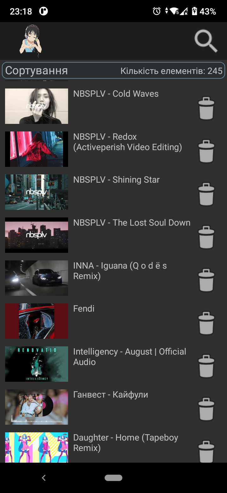
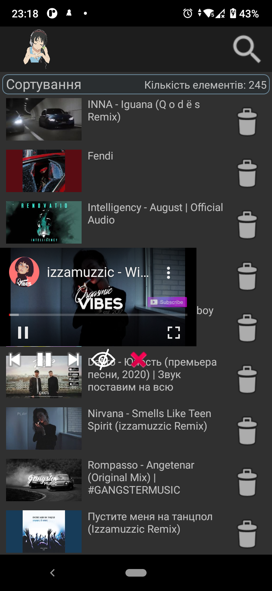
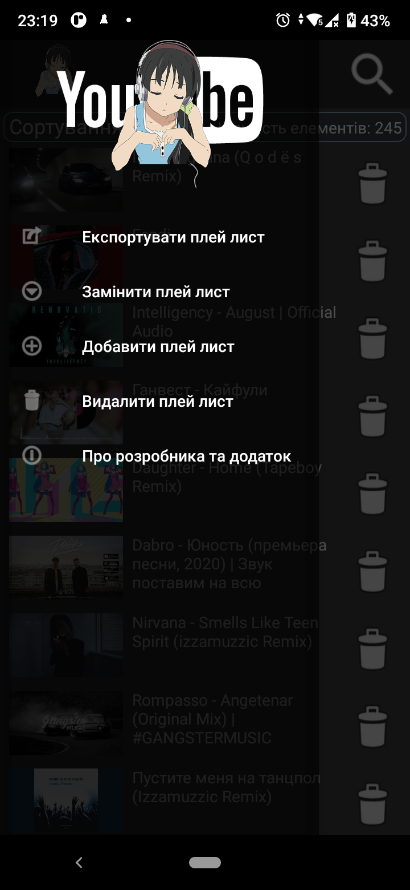
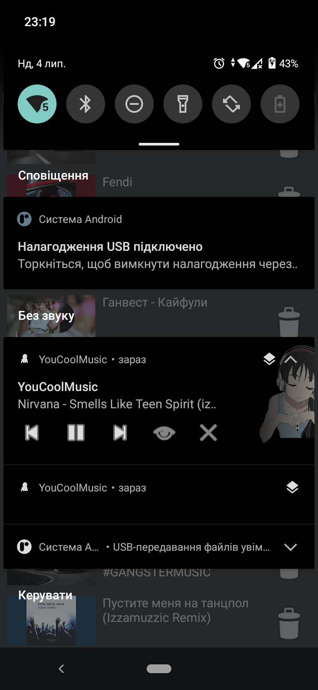

<p align="center"></p>
<h1 align="center">YouCoolMusic</h1>

## Description
<b>EN:</b>

My analogue is **YouTube Music** and **YouTube Premium**.

The app uses the ***YouTube API KEY*** to search for videos on **YouTube**. [References to documentation](https://developers.google.com/youtube/v3/docs/search/list). 
Using this **API** key occurs in the following lines:

```java
68        task.execute("https://www.googleapis.com/youtube/v3/search?maxResults=50&part=snippet,id&type=video&q=Музыка&key=[YouTube_API_KEY]");
```
```java
84                        task.execute("https://www.googleapis.com/youtube/v3/search?maxResults=50&part=snippet,id&type=video&q=" + URLEncoder.encode(name, String.valueOf(StandardCharsets.UTF_8))
85                                + "&key=[YouTube_API_KEY]");
``` 

Link to file from [**YouTube_API_KEY**](app/src/main/java/com/example/youcoolmusic/Activity/SearchActivity.java).

<b>UA:</b>

Мій аналог - **YouTube Music** та **YouTube Premium**.

В додатку використовується ***YouTube API KEY*** для пошуку відео в **YouTube**. [Посилання на документацію](https://developers.google.com/youtube/v3/docs/search/list). 
Використання цього **API** ключа зустрічається таких рядках:

```java
68        task.execute("https://www.googleapis.com/youtube/v3/search?maxResults=50&part=snippet,id&type=video&q=Музыка&key=[YouTube_API_KEY]");
```
```java
84                        task.execute("https://www.googleapis.com/youtube/v3/search?maxResults=50&part=snippet,id&type=video&q=" + URLEncoder.encode(name, String.valueOf(StandardCharsets.UTF_8))
85                                + "&key=[YouTube_API_KEY]");
```                                

Посилання на файл із [**YouTube_API_KEY**](app/src/main/java/com/example/youcoolmusic/Activity/SearchActivity.java).

#
## Screenshots
<p>
  
  
  
  
</p>

#
## Technologies used
<b>EN:</b>
- Working with the [**YouTube API**](https://developers.google.com/youtube/v3)
- Opening windows on top of all other programs (***SYSTEM_ALERT_WINDOW***)
- Using the music player in the status bar
- Using the service to play music in the background (***FOREGROUND_SERVICE***)
- Working with the local database [**SQLiteOpenHelper**](https://developer.android.com/reference/android/database/sqlite/SQLiteOpenHelper)
- Working with files (Saving and importing playlists)
- Using the element interface to display a list of elements from an array ([**RecyclerView**](https://developer.android.com/reference/androidx/recyclerview/widget/RecyclerView))
- Image caching and rendering via [**Picasso**](https://square.github.io/picasso/)

<b>UA:</b>
- Робота з [**YouTube API**](https://developers.google.com/youtube/v3)
- Відкриття вікон поверх усіх інших програм (***SYSTEM_ALERT_WINDOW***)
- Використання музичного плеєра в статус-барі
- Використання сервісу для відтворення музики у фоновому режимі (***FOREGROUND_SERVICE***)
- Робота з локальною базою даних [**SQLiteOpenHelper**](https://developer.android.com/reference/android/database/sqlite/SQLiteOpenHelper)
- Робота з файлами (Збереження та імпорт списків відтворення)
- Використання інтерфейсу елемента для відображення списку елементів з масиву ([**RecyclerView**](https://developer.android.com/reference/androidx/recyclerview/widget/RecyclerView))
- Кешування та відображення зображення через [**Picasso**](https://square.github.io/picasso/)

#
## License
```
© 2020, CoolOtaku (ericspz531@gmail.com)
```
